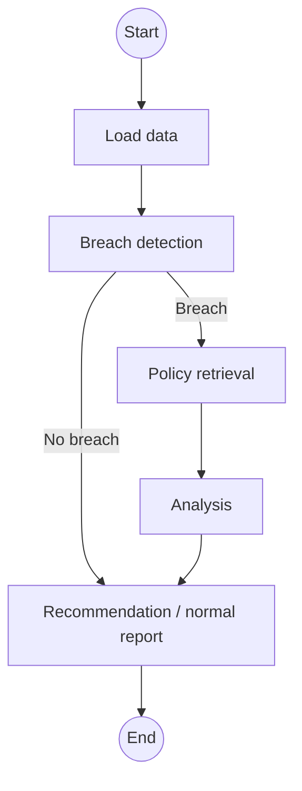

# model-monitoring-agent-project

Python foundation for a model-performance monitoring application, extended with a small **policy RAG module** and a **read-only monitoring agent**. This phase contains no MCP implementation.

## What is included

- Pydantic schemas for model inventory and monthly monitoring records.
- Synthetic monitoring data across application, behaviour, collections and fraud models.
- A policy library with enterprise governance documents plus product-specific monitoring standards.
- A small local RAG pipeline that:
  - loads Markdown documents from `policies/`,
  - preserves source metadata,
  - chunks the documents,
  - creates deterministic local vector embeddings,
  - stores embeddings and chunks in a SQLite-backed local vector store,
  - retrieves top-k passages,
  - returns passage text, similarity score and source metadata.
- A separate extractive answer layer so retrieval can be evaluated independently from answer construction.
- A read-only LangGraph agent that runs deterministic monitoring tools, conditionally retrieves policy evidence and returns cited recommendations with a structured audit log of every tool call.
- pytest tests for document loading, metadata, retrieval, grounded answering and invalid queries.

## Setup and test

```bash
python -m venv .venv
PowerShell: .venv\Scripts\Activate.ps1 #source .venv/bin/activate  # Windows 
python -m pip install -r requirements.txt
pytest
```

## Run the RAG example

```bash
python -m model_monitoring.rag.demo
```

The demo asks:

```text
What action is required when PSI exceeds 0.25?
```

The expected policy conclusion is that a PSI at or above 0.25 is a **RED breach**. It requires escalation to the model owner and Model Risk Management, followed by investigation of the population segments driving the shift.

The response object contains:

```text
question
answer
passages[]
    text
    source
    path
    chunk_index
    score
    metadata
```

## Run the monitoring agent

Build the policy index as a separate setup operation, then pass the retriever to
the agent. The agent itself only calls `retrieve()` and never builds or mutates
the index.

```python
from model_monitoring.agent import MonitoringAgent
from model_monitoring.rag.retrieval import PolicyRetriever

retriever = PolicyRetriever()
retriever.build_index()  # Setup operation outside the agent.

result = MonitoringAgent(retriever).run("M001", "2026-07")
print(result.recommendation.model_dump(mode="json"))
print([entry.model_dump(mode="json") for entry in result.tool_call_log])
```

For normal use, run the concise CLI against the prebuilt read-only index:

```bash
python -m model_monitoring.agent M001 2026-07
python -m model_monitoring.agent M001 2026-07 --show-audit
python -m model_monitoring.agent M001 2026-07 --json
```

The default view omits full retrieved passage text. Use `--json` for complete
policy evidence and serialized tool inputs/outputs, or `--log-tool-calls` to
emit each structured tool call to stderr.

The runtime is an explicit LangGraph workflow. Normal results bypass retrieval;
breaches enter the policy-grounded investigation path:



### Graph state

`MonitoringGraphState` is a Pydantic model shared by all nodes. It begins with
`model_id` and `period`, then is enriched without changing the deterministic
monitoring calculations:

| Node | Reads | Adds to state |
|---|---|---|
| Loading data | `model_id`, `period` | `current_metrics`, ordered `historical_metrics`, `previous_metrics` |
| Breach detection | current and previous metrics | deterministic `breaches` from `detect_breaches()` |
| Policy retrieval (breach only) | `breaches` | cited `policy_evidence` |
| Analysis (breach only) | `breaches`, `policy_evidence` | a policy-grounded recommendation draft in `analysis` |
| Recommendation | breaches and optional analysis/evidence | final `recommendation`; for the no-breach route this is the normal report |

The public `MonitoringAgentResult` remains the stable output boundary and adds
the run's structured `tool_call_log` to the graph state results.

The recommendation builder receives only deterministic `Breach` objects and
retrieved policy passages. It cannot recalculate PSI or AUC from raw monitoring
metrics. Recommendations are text output only and every recommended action
contains policy citation identifiers such as `monitoring_policy.md#chunk-2`.

## RAG data flow

```text
policies/*.md
    ↓
load_markdown_documents()
    ↓
PolicyDocument
    ↓
chunk_documents()
    ↓
PolicyChunk
    ↓
HashingEmbedder.embed()
    ↓
fixed-size local vectors
    ↓
LocalVectorStore (SQLite)
    ↓
PolicyRetriever.retrieve(question, top_k)
    ↓
RetrievedPassage[]
    ↓
build_grounded_answer(question, passages)
    ↓
answer + retrieved evidence + source metadata
```

## Why retrieval and answering are separate

`PolicyRetriever.retrieve()` performs only retrieval. It does not generate an answer. This means retrieval can be tested independently for questions such as:

- Was the correct policy retrieved?
- Was the correct passage ranked first?
- Was the source document preserved?
- Did a product-specific document incorrectly outrank the enterprise policy?

`build_grounded_answer()` receives already retrieved passages and constructs a small extractive answer. A future LLM generation layer can replace this function without changing the retrieval tests.

## Local embedding choice

This learning version uses a deterministic hashing embedder implemented in Python. It requires no API key, network request, model download or additional dependency, which keeps retrieval tests reproducible and makes the mechanics visible.

It is intentionally simpler than a production semantic embedding model. Later, `HashingEmbedder` can be replaced by a SentenceTransformers/OpenAI/other embedding adapter while leaving the `PolicyRetriever` interface and evaluation dataset unchanged.

## Repository structure

```text
model-monitoring-agent-project/
├── src/model_monitoring/
│   ├── __init__.py
│   ├── loaders.py
│   ├── models.py
│   └── rag/
│       ├── __init__.py
│       ├── retrieval.py
│       ├── answering.py
│       └── demo.py
├── data/
├── policies/
│   ├── monitoring_thresholds.md
│   ├── monitoring_policy.md
│   ├── validation_policy.md
│   ├── escalation_procedure.md
│   ├── model_governance_policy.md
│   ├── previous_validation_report.md
│   ├── application_scorecard_monitoring.md
│   ├── behaviour_scorecard_monitoring.md
│   ├── collections_model_monitoring.md
│   ├── fraud_model_monitoring.md
│   └── credit_limit_model_monitoring.md
├── tests/
│   ├── test_data_files.py
│   ├── test_models.py
│   └── test_rag.py
├── evals/
├── notebooks/
├── .gitignore
├── pytest.ini
├── requirements.txt
└── README.md
```

## Intentional limitations

- The policy documents and monitoring data are synthetic learning examples, not approved production policy.
- The local hashing embedder is deterministic and transparent but less semantically capable than a trained embedding model.
- Similarity search currently reads the small local vector table and calculates cosine-equivalent dot-product ranking in Python; this is appropriate for a small learning corpus, not enterprise-scale retrieval.
- The answer layer is extractive rather than an LLM generator.
- No MCP server/client, autonomous action, or production database integration has been added yet.
